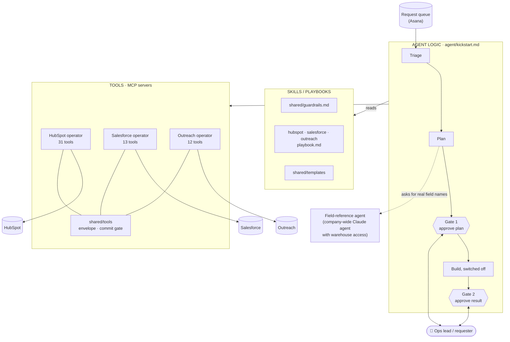
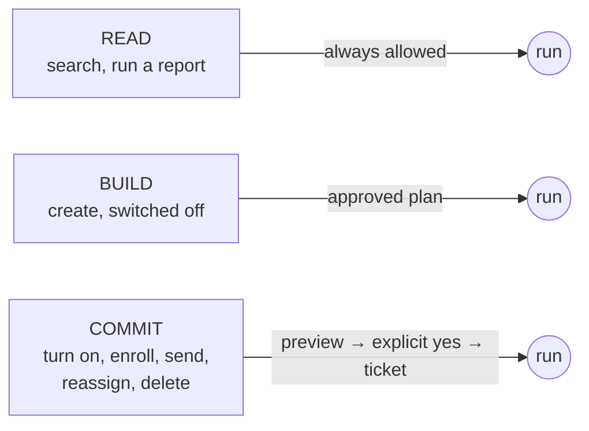
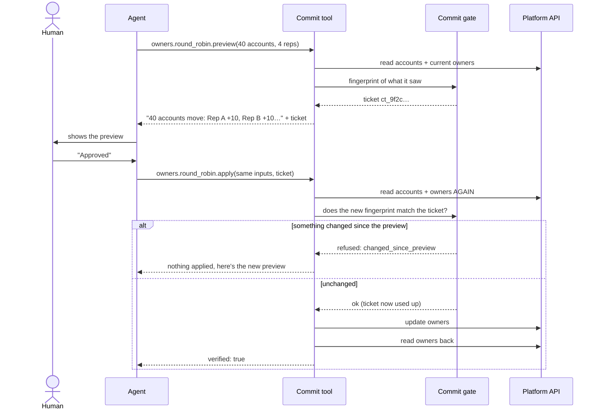

# Architecture

## The big picture



**Reading it top to bottom:**

1. **Agent logic** decides *what to do next*. It's plain English (a Claude skill), not code.
2. **Skills / playbooks** hold *how to do it well*: the rules for each platform, and the templates for plans and reports. Also plain English.
3. **Tools** *do the actual work*: small, strict programs that call each platform's API. Every one answers in the same format and checks its own work.

## The three safety levels

Every tool falls into one level. The level decides what has to happen before it runs.



## How a Commit action runs

Every Commit action is published as **two tools**: `<name>.preview` and `<name>.apply`.



The **fingerprint** is a hash of everything that matters for that action: which records, their current owners, a workflow's revision number, the inputs themselves. If any of it changes between preview and apply, the hashes differ and nothing happens.

## The response every tool gives

All 56 tools answer in the same shape, so one agent can drive three platforms without learning three ways of reporting success:

```jsonc
{
  "ok": true,
  "operation": "campaigns.create",
  "data": { "campaign": { "Id": "701…", "Name": "ACME Webinar - Q4", "IsActive": false } },
  "audit": {
    "attempted": true,   // did it try to change something?
    "verified": true,    // did it read the system back and confirm the change?
    "targetType": "campaign",
    "targetId": "701…"
  }
}
```

## Repo map

```
gtm-ops-agents/
  agent/kickstart.md          Agent logic: the request-queue loop and its gates
  shared/
    guardrails.md             The three levels and the rules that always apply
    templates/                Plan, build report, requester comment
    tools/src/
      commitGate.ts           Preview tickets: issue, check, expire
      commitTools.ts          Turns a Commit action into .preview + .apply tools
      envelope.ts             The shared response shape
  hubspot/     playbook.md + tools/ (workflows, lists, CRM records)
  salesforce/  playbook.md + tools/ (reports, campaigns, owners, territories)
  outreach/    playbook.md + tools/ (prospects, sequences, enrollment, token rotation)
  examples/walkthrough.md     One request, start to finish
  docs/                       This file, and the design decisions
```

## Tech

TypeScript (strict) · [Model Context Protocol](https://modelcontextprotocol.io) SDK · `zod` input schemas · Node's built-in test runner · `dotenv` · HubSpot REST v3/v4 · Salesforce REST + Analytics API · Outreach API v2 (JSON:API).
